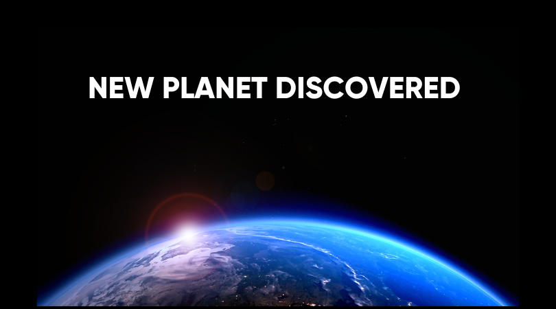

# 🪐 Exclusive Space Discovery

Welcome to the repository of the most recent and astonishing space discovery! Dive deep into the unknown and witness the wonders of the cosmos.

## Overview

This website is dedicated to unveiling the mysteries of the universe. With exclusive footage and detailed reports, we bring you closer to the stars and the secrets they hold.

## Features

- **Breaking News Section**: Get the latest updates on space discoveries.
- **Exclusive Footage**: Witness the unseen with our exclusive videos and images.
- **Interactive UI**: Navigate through the universe with our interactive user interface.
- **Mobile Responsive**: Explore the cosmos on any device, from desktop to mobile.

## How to Use

1. Navigate to [Exclusive Space Discovery](https://GalacticPranks.github.io/NewPlanetDiscovery/).
2. Explore the homepage for the latest news.
3. Click on the "Discover More" button to dive deeper into the discovery.
4. Share with friends and fellow space enthusiasts!

## Contributing

While this repository is mainly for fun, contributions are always welcome! If you have suggestions, improvements, or want to add more space-related pranks, feel free to open a pull request.

## Disclaimer

This website is intended for entertainment purposes only. Always approach with a sense of humor!
